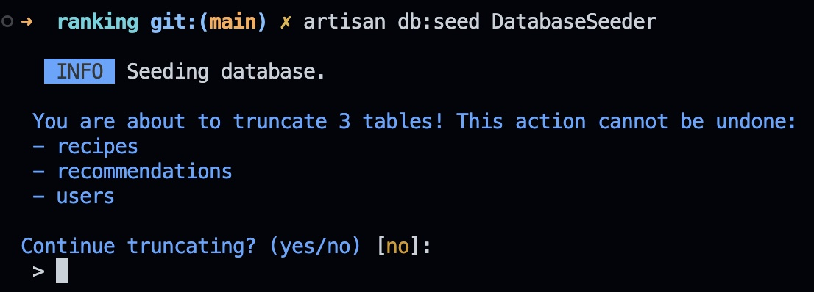

<p align="center"></p>

<p align="center">
    <a href="https://packagist.org/packages/snowbuilds/laravel-seeder-reset">
        
    </a>
    <a href="https://packagist.org/packages/snowbuilds/laravel-seeder-reset">
        
    </a>
    <a href="#">
        
    </a>
</p>


- [Introduction](#introduction)
- [Installation](#installation)
- [Usage](#usage)
    - [List tables to truncate](#list-tables-truncate)
    - [Reset seeders](#reset-seeders)
    - [Override seeder](#override-seeder)
    - [Hooks](#hooks)
- [Roadmap](#roadmap)
- [Changelog](#changelog)
- [Contributing](#contributing)
- [Security Vulnerabilities](#security)
- [Code of Conduct](#code-of-conduct)
- [License](#license)

<a name="introduction"></a>
## Introduction
Prompt developers to truncate tables and delete old data before executing seeders. Great for seeding projects that prohibit duplicate data!

<p align="left"></p>

<a name="installation"></a>
## Installation

You can install the package via composer:

```bash
composer require "snowbuilds/laravel-seeder-reset:^0.0.1-alpha"
```

```bash
php artisan vendor:publish --provider="SnowBuilds\SeederReset\SeederResetServiceProvider"
```

<a name="usage"></a>
## Usage
Include the `SnowBuilds\SeederReset\Concerns\SeederTruncate` trait in your seeder class. Next time you run the seeder, you will be prompted to truncate seeders. When choose to truncate, the specified models are truncated before running the seeder:

```php
use SnowBuilds\SeederReset\Concerns\SeederTruncate;

use Illuminate\Database\Seeder;

class PostSeeder extends Seeder
{
    use SeederTruncate;

    public $truncate = [
        App\Models\User::class,
        App\Models\Comment::class,
        App\Models\Post::class,
    ];

    public function run () {
        //
    }
}
```

<a name="list-tables-truncate"></a>
### List tables to truncate
When the truncate property is not enough, you can return an array from the `getTruncate` method:

```php
use SnowBuilds\SeederReset\Concerns\SeederTruncate;

use Illuminate\Database\Seeder;

class PostSeeder extends Seeder
{
    use SeederTruncate;

    public function getTruncate() {
        return [
            App\Models\User::class,
            App\Models\Comment::class,
            App\Models\Post::class,
        ]
    };

    public function run () {
        //
    }
}
```

<a name="reset-seeders"></a>
### Reset Seeders - Call Truncate
Sometimes you may have seeders which call other seeders. If you only want to be prompted once you can invoke the truncate method:

```php
use SnowBuilds\SeederReset\Concerns\SeederTruncate;

use Illuminate\Database\Seeder;

class DatabaseSeeder extends Seeder
{
    use SeederTruncate;

    public function run () {
        $this->truncate([
            UserSeeder::class,
            RecipeSeeder::class,
        ]);

        $this->call([
            UserSeeder::class,
            RecipeSeeder::class,
        ]);
    }
}
```

### Reset Seeders - Replace Call
If you are looking for something a little more implicit, you can replace the `call` method with the `reset` method, which will reset each seeder before invoking:

```php
use SnowBuilds\SeederReset\Concerns\SeederTruncate;

use Illuminate\Database\Seeder;

class DatabaseSeeder extends Seeder
{
    use SeederTruncate;

    public function run () {
        $this->reset([
            UserSeeder::class,
            RecipeSeeder::class,
        ]);
    }
}
```

<a name="override-seeders"></a>
### Override Seeder
If you want to keep the same API but want to call other seeders we recommend extending `SnowBuilds\SeederReset\Seeder`:

```php
use SnowBuilds\SeederReset\Concerns\SeederTruncate;

use SnowBuilds\SeederReset\Seeder;

class DatabaseSeeder extends Seeder
{
    public function run () {
        $this->call([
            UserSeeder::class,
            RecipeSeeder::class,
        ]);
    }
}
```

<a name="hooks"></a>
### Hooks
Sometimes truncating is not enough, and you need delete specific rows before seeding. We included `beforeTruncate` and `afterTruncate` hooks which can be used to delete whatever you want. If the hook fails the operation will rollback.

> **Important**
> The truncate operation is not performed in a transaction due to MySql limitations. If a hook fails, tables that were truncated will remain empty.

```php
use SnowBuilds\SeederReset\Concerns\SeederTruncate;

use SnowBuilds\SeederReset\Seeder;

class DatabaseSeeder extends Seeder
{
    public function beforeTruncate()
    {
        User::moderators()->delete();
        User::customers()->delete();
    }

    public function run () {
        $this->call([
            UserSeeder::class,
            RecipeSeeder::class,
        ]);
    }
}
```

<a name="roadmap"></a>
## Roadmap
- [x] Truncate tables from list of models
- [x] Truncate using table names
- [x] Delete data using queries


<a name="changelog"></a>
### Changelog

Please see [CHANGELOG](CHANGELOG.md) for more information on what has changed recently.

<a name="contributing"></a>
## Contributing

Please see [CONTRIBUTING](CONTRIBUTING.md) for details.

<a name="security"></a>
### Security

If you discover any security-related issues, please email dev@snowlaboratory.com instead of using the issue tracker.

## Code of Conduct
<a name="code-of-conduct"></a>

In order to ensure that the Laravel community is welcoming to all, please review and abide by the [Code of Conduct](https://laravel.com/docs/contributions#code-of-conduct).

<a name="credits"></a>
## Credits

-   [Snow Labs](https://github.com/snowbuilds)
-   [All Contributors](../../contributors)

<a name="license"></a>
## License

The MIT License (MIT). Please see [License File](LICENSE.md) for more information.
